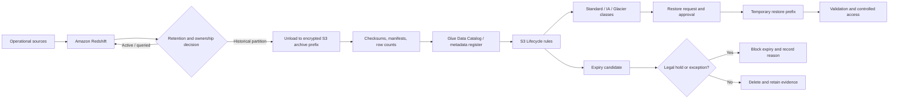

# Reference architecture

## Intent

Separate the **system of record**, **archive copy**, **metadata**, and **evidence**. S3 is the archive substrate; Redshift remains the query engine for data that is still operationally useful. Historical Redshift data can be unloaded to S3 in an open format such as Parquet, registered in a catalog, and removed from the cluster only after validation and approval.

## Logical flow

## Control-plane components

| Component | Responsibility |
| --- | --- |
| Dataset register | Source of truth for purpose, owner, classification, retention, RTO, and region |
| Policy repository | Versioned policy-as-code, review history, approvals, and exceptions |
| S3 tags / prefixes | Machine-readable routing keys such as `retention-class`, `owner-id`, and `legal-hold` |
| Lifecycle configuration | Transition and expiration behavior for object populations |
| Redshift unload job | Writes historical partitions, manifests, and metadata to S3 |
| Data Catalog | Makes archive contents discoverable without copying data back |
| Evidence store | Immutable logs, manifests, restore results, approvals, and deletion records |
| Cost and usage reports | Measures storage, requests, retrieval, and forecast against the estimate |

## S3 design rules

- Use separate prefixes or buckets for different trust boundaries and retention classes where policy isolation matters.
- Enable versioning where recovery from overwrite is required; understand that noncurrent versions also need lifecycle management.
- Use S3 Object Lock in governance or compliance mode only after legal and operational review.
- Use SSE-KMS for controlled keys and key policies; define what happens to keys during the retention period.
- Block public access, require TLS, and log data-plane access appropriate to the sensitivity.
- Apply lifecycle rules to tagged populations, not broad prefixes, when datasets have different obligations.
- Add an incomplete multipart upload abort rule and noncurrent-version rules intentionally.

## Redshift design rules

- Partition historical data by a stable business date or event time, not by an arbitrary unload batch.
- Unload to Parquet with a manifest and deterministic prefix. Record schema version and source snapshot.
- Validate counts, aggregates, checksums, and sample queries before deleting cluster data.
- Keep the catalog and restore instructions with the archive; an object without enough metadata is not recoverable data.
- Use snapshots for cluster recovery and archival exports for long-term data retention; they have different purposes and costs.

## Failure modes to design for

| Failure | Preventive or detective control |
| --- | --- |
| Wrong owner or missing owner | Quarantine, no automatic expiry, escalation queue |
| Lifecycle selector matches too much | Inventory preview, policy test, change approval |
| Archive cannot be read | Scheduled restore test and checksum validation |
| Legal hold ignored | Hold registry checked before expiry; Object Lock where appropriate |
| KMS key unavailable | Key ownership, rotation, recovery, and retention runbook |
| “Savings” hides retrieval cost | Scenario calculator plus actual Cost and Usage Report review |
| Redshift delete happens before archive validation | Two-person approval and explicit validation gate |
